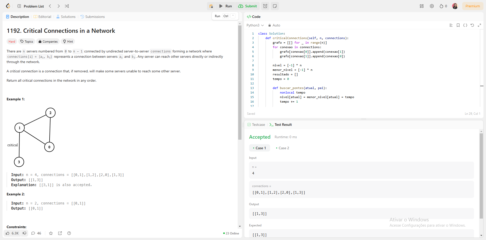
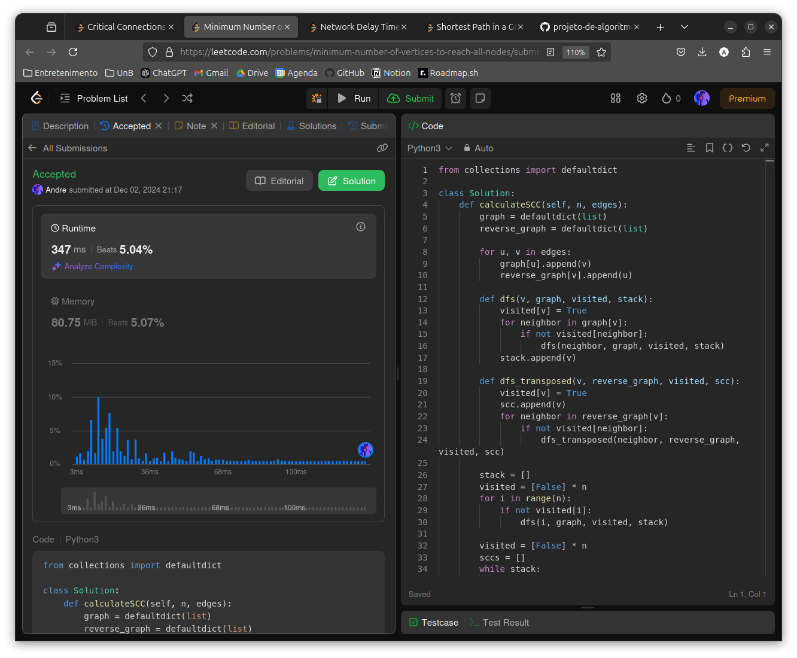
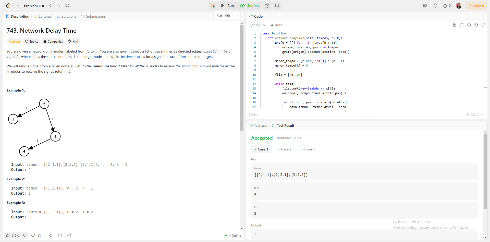
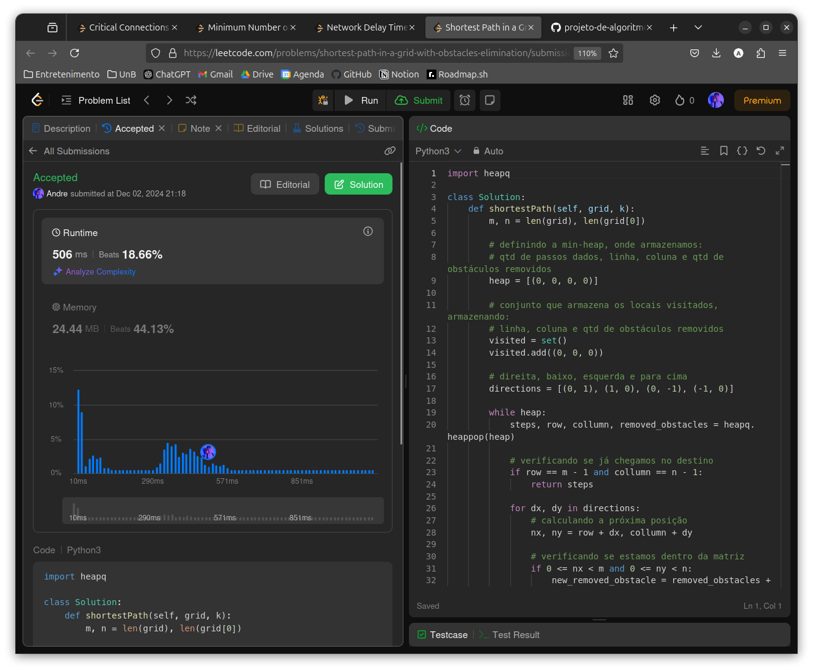

# Grafos2_LeetCode

**Número da Lista**: 3 
**Conteúdo da Disciplina**: Grafos2 

## Alunos
|Matrícula | Aluno |
| -- | -- |
| 22/2037648  |  André Cláudio Maia da Cunha |
| 21/1062713 |  	Paola Rebeca Lima do Nascimento |

## Sobre 
Neste trabalho, focaremos nos seguintes conteúdos:
- SCC;
- Dijkstra.

Faremos isso, respondendo questões de níveis difíceis e médias do LeetCode, referente a um dos três conteúdos mencionados acima. As questões que responderemos serão:
- [Problema 1192](https://leetcode.com/problems/critical-connections-in-a-network/description/)
- [Problema 1557](https://leetcode.com/problems/minimum-number-of-vertices-to-reach-all-nodes/description/)
- [Problema 743](https://leetcode.com/problems/network-delay-time/description/)
- [Problema 1293](https://leetcode.com/problems/shortest-path-in-a-grid-with-obstacles-elimination/description/)

## Screenshots
**PROBLEMA 1192**

**PROBLEMA 1557**

**PROBLEMA 743**

**PROBLEMA 1293**

## Instalação 
**Linguagem**: Python3 

## Uso 
Copie o código da questão e cole no respectivo problema no LeetCode. Após isso, clique em "submit" para ver o Online Judge verificando se a solução é válida.

## Link do vídeo
-[Clique Aqui!](https://youtu.be/nbZr4rKi9qk)

